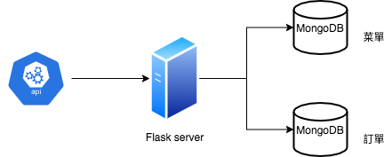
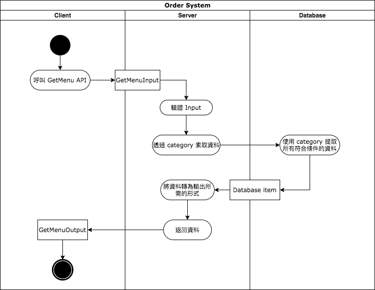
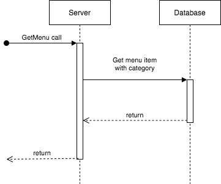

# 點餐系統後端API設計文件

## Use Cases
1. 當前端向後端發送索取菜單的請求時，後端要返回完整的菜單
2. 當前端向後端發送索取菜單的請求，並提供菜單類別時，後端要返回對應該類別的菜單
3. 當前端透過提供訂單號碼，向後端發送索取訂單的請求時，後端要返回對應該號碼的訂單
4. 當前端透過提供顧客姓名，向後端發送索取訂單的請求時，後端要返回該顧客所有的訂單
5. 當前端向後端發送建立訂單的請求時，須提供顧客姓名、下單時間、以及所有要下訂的菜單項目。收到請求後，後端要在資料庫中創建訂單，創建成功時要返回訂單的號碼
6. 當前端向後端發送刪除訂單的請求時，須提供訂單的號碼。收到請求後，後端要在資料庫中刪除訂單，刪除成功時要返回訂單的號碼

## Requirements
### Must have
- 返回菜單的 API
    - 請求內容為空時， 返回完整菜單
    - 請求中包含菜單類別時， 返回對應該類別的菜單
    - 若請求中的菜單類別不存在，則返回 error
- 查詢訂單的 API
    - 請求中包含訂單號碼時，返回對應該號碼的訂單
    - 若請求中的訂單號碼不存在，則返回 error
    - 請求中包含顧客姓名時，返回對應該顧客的所有訂單
    - 若請求中的顧客姓名不存在，則返回 error
- 建立訂單的 API
    - 請求中包含顧客姓名、下單時間、菜單項目時，在資料庫中創建訂單，成功後要返回訂單的號碼與狀態
    - 若請求中不包含顧客姓名、下單時間、菜單項目之中其一，則返回 error
- 刪除訂單的 API
    - 請求中包含訂單號碼時，在資料庫中刪除訂單，成功後要返回對應該號碼的訂單資訊
    - 若請求中的訂單號碼不存在，則返回 error
    - 若請求中的訂單的狀態為已送出，則返回 error

### Could Have
- 修改訂單的 API
    - 請求中包含訂單號碼時，在資料庫中修改訂單，成功後要返回對應該號碼的訂單
    - 若請求中的訂單號碼不存在，則返回 error

### Out-Of-Scope
- 對返回的菜單進行排序的功能不在此專案的範圍內，會由前端負責實現。由後端返回的菜單品項沒有特定順序

## API Specification
### GetMenu
- 簡介： 讀取菜單資訊。若請求中有提供菜單類別，則只返回相對應類別的菜單內容。
- 輸入:
    ```
    GetMenuInout: {
        @optional category: enum["Entree", "Side", "Drink"]
    }
    ```

- 輸出：
    ```
    GetMenuOutput: {
        menu: array<MenuItem>
    }

    MenuItem: {
        name: String,
        category: enum["Entree", "Side", "Drink"],
        price: int
    }
    ```

- Exception:
    - Invalid Input - 當輸入值的結構不符合 GetMenuInput 的要求時，返回此錯誤
    - Internal Server Error - 任何系統錯誤

### GetOrder
- 簡介： 輸入訂單號碼以讀取訂單資訊
- 輸入:
    ```
    GetOrderInput: {
        id: String,
    }

    GetCustomerOrdersInput: {
        customer: String,
    }
    ```

- 輸出：
    ```
    GetOrderOuput: {
        order: OrderItem
    }

    GetCustomerOrdersOuput: {
        orders: array<OrderItem>
    }

    OrderItem: {
        id: String,
        customer: String,
        orderTime: timestamp,
        items: array<MenuItem.name>,
        totalPrice: int,
        status: String
    }
    ```

- Exception:
    - Invalid Input - 當輸入值的結構不符合 GetOrderInput 或 GetCustomerOrdersInput 的要求時，返回此錯誤
    - Internal Server Error - 任何系統錯誤

### CreateOrder

- 簡介： 輸入顧客姓名、下單時間、以及所有要下訂的菜單項目以創建訂單，成功創建訂單時返回訂單號碼與訂單狀態
- 輸入:
    ```
    CreateOrderInput: {
        customer: String,
        orderTime: timestamp,
        items: array<MenuItem.name>
    }
    ```

- 輸出：
    ```
    GetOrderOuput: {
        id: String,
        status: String
    }
    ```

- Exception:
    - Invalid Input - 當輸入值的結構不符合 CreateOrderInput 的要求時，返回此錯誤
    - Internal Server Error - 任何系統錯誤

### DeleteOrder
- 簡介： 輸入訂單號碼以刪除訂單，成功刪除訂單時返回訂單號碼與訂單狀態
- 輸入:
    ```
    DeleteOrderInput: {
        id: String
    }
    ```

- 輸出：
    ```
    DeleteOrderInput: {
        id: String,
        status: String
    }
    ```

- Exception:
    - Invalid Input - 當輸入值的結構不符合 DeleteOrderInput 的要求時，返回此錯誤
    - Internal Server Error - 任何系統錯誤

## Data Model
### Menu
- structure:
    ```
    {
        @primary id: ObjectId,
        name: String,
        category: enum["Entree", "Side", "Drink"],
        price: int,
        type: enum["Regular", "Seasonal"]
    }
    ```

- Index:
    - category

### Order
- structure:
    ```
    {
        @primary id: String,
        customer: String,
        orderTime: timestamp,
        items: array<MenuItem.id>,
        totalPrice: int,
        status: String
    }
    ```

- Index:
    - customer

## Component Diargram


## Activity Diargram


## Sequence Diargram


## Timeline
| Component | Task  | Description | Blocked by | Processing Time | Deadline |
| --- | --- | --- | --- | --- | --- |
| 建立菜單資料庫 |  |  |  |  | Sprint 1 |
|  | 1 | 建立目前所有菜單項目 |  | 4 days |  |
| 查詢菜單API |  |  |  |  | Sprint 1 |
|  | 2 | 讀取並檢查輸入值 | Task 1 | 2 days |  |
|  | 3 | 從資料庫查詢所需資料 | Task 2 | 3 days |  |
| 查詢訂單API |  |  |  |  | Sprint 2 |
|  | 4 | 讀取並檢查輸入值 | Task 3 | 2 days |  |
|  | 5 | 從資料庫查詢所需資料 | Task 4 | 3 days |  |
| 建立訂單API |  |  |  |  | Sprint 2 |
|  | 6 | 讀取並檢查輸入值 | Task 3 | 2 days |  |
|  | 7 | 從資料庫查詢所需資料 | Task 6 | 3 days |  |
| 刪除訂單API |  |  |  |  | Sprint 2 |
|  | 8 | 讀取並檢查輸入值 | Task 3 | 2 days |  |
|  | 9 | 從資料庫修改所需資料 | Task 8 | 3 days |  |